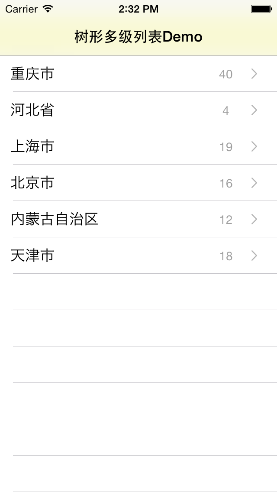
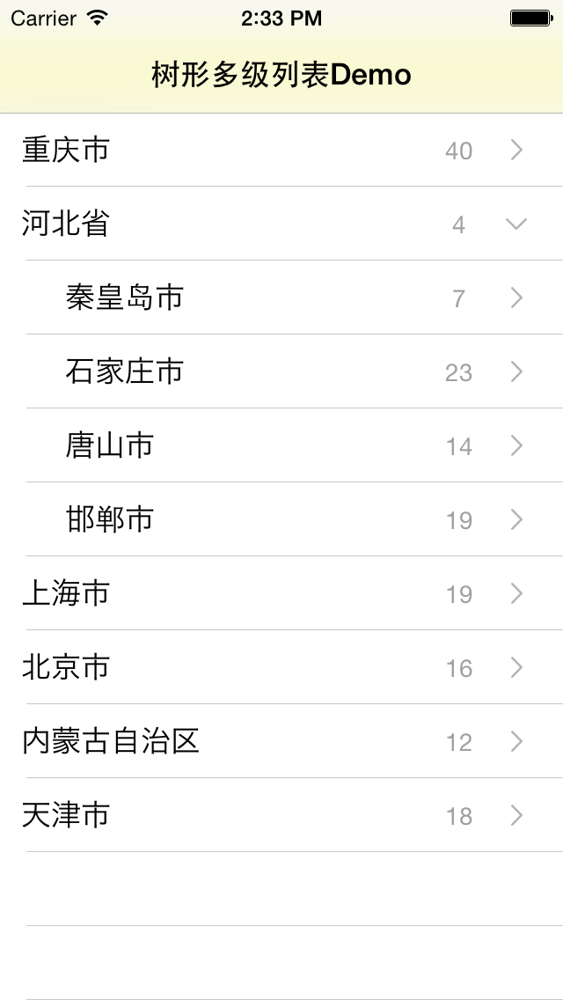
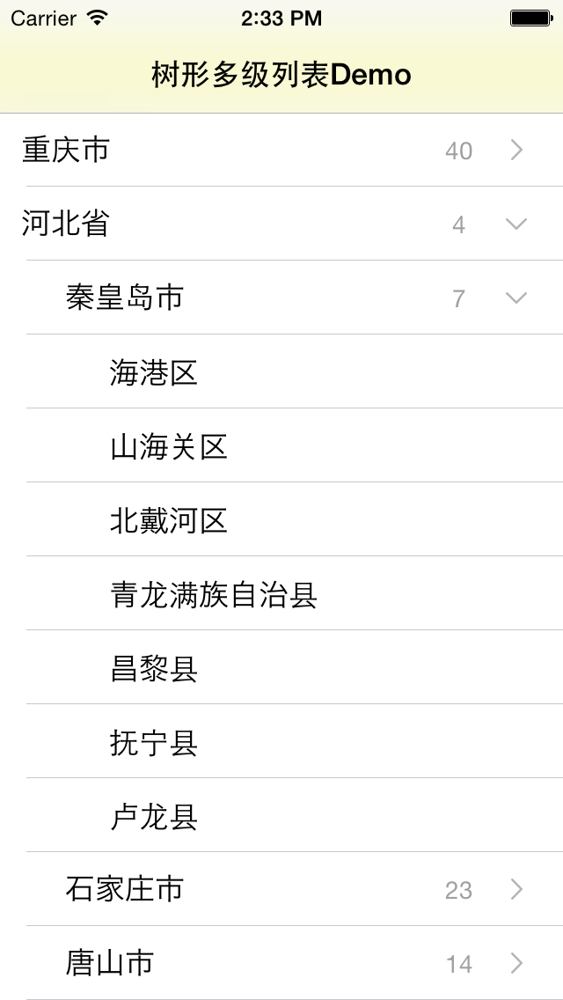

HZTreeLableView
===============
树形下拉列表
Preview
---
###第一级列表

###第二级列表

###第三级列表

Usage
---
Check out the [demo app](https://github.com/khzliu/HZTreeLableView/archive/master.zip) for an example.

Requirements
---
- iOS 7 or higher.
- Automatic Reference Counting (ARC).

License
---
ZLSwipeableView is available under MIT license. See the LICENSE file for more info.
